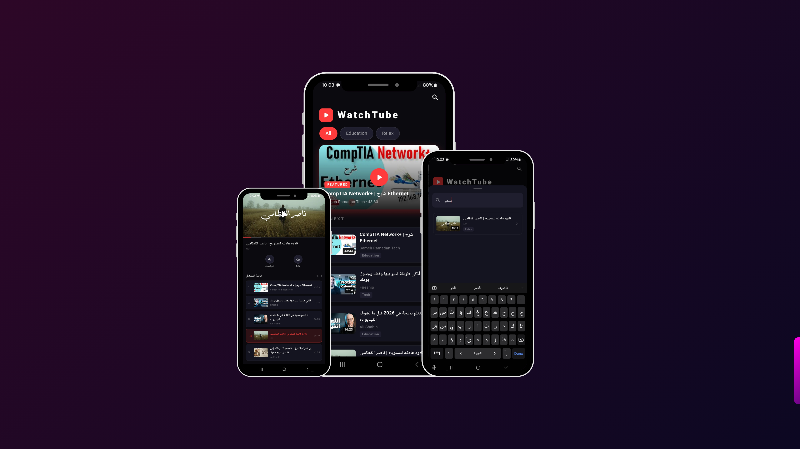

# 🎬 WatchTube
A clean and minimal YouTube player app built with Flutter.


---

## ✨ Features

- 🎥 **YouTube Player** — Full playback with progress bar and fullscreen support
- 📋 **Playlist** — Browse and switch between videos with one tap
- 🔇 **Mute / Unmute** — Toggle audio instantly
- ⚡ **Playback Speed** — Choose from 0.25x to 2.0x
- 🔍 **Search** — Filter videos by title or channel name
- 🗂️ **Categories** — Filter by Music, Tech, Viral, and more
- 🖼️ **Auto Thumbnails** — Thumbnails load automatically from YouTube — no API needed
- 🔗 **Flexible Video IDs** — Paste a full YouTube URL or just the video ID

---

## 📸 Screenshots



---

## 📱 Download APK

> Try the app directly without building from source

[](https://drive.google.com/file/d/11goTwnRtpcin1eK_kGi75b9JnBwldOXB/view?usp=drivesdk)

---

## 🎬 Demo Video

> Watch the app in action

[](https://drive.google.com/file/d/1ctSmD6_bjr5lTCjCX8jwQPo6BzGoTg9t/view?usp=drivesdk)

---

## 🚀 Getting Started

### Prerequisites

- Flutter SDK `>= 3.0.0`
- Android SDK with a physical device or emulator

### Installation

```bash
# 1. Clone the repo
git clone https://github.com/taha2901/watch_tube.git
cd watch_tube

# 2. Install dependencies
flutter pub get

# 3. Run the app
flutter run --no-enable-impeller
```

> ⚠️ Use `--no-enable-impeller` to avoid rendering issues with WebView on some devices.

---

## 📦 Dependencies

```yaml
dependencies:
  youtube_player_flutter: ^9.1.1
```

---

## ➕ Adding Your Own Videos

Open `lib/models/vedio_items_model.dart` and add to the `kVideos` list.

You can use a **full YouTube URL** or just the **video ID**:

```dart
// ✅ Full URL
VideoItem(
  id: 'https://www.youtube.com/watch?v=qKS4ZfKENew',
  title: 'My Video Title',
  channel: 'Channel Name',
  duration: '10:30',
  category: 'Education',
),

// ✅ Video ID only
VideoItem(
  id: 'qKS4ZfKENew',
  title: 'My Video Title',
  channel: 'Channel Name',
  duration: '10:30',
  category: 'Tech',
),
```

**How to get a Video ID from YouTube:**
```
https://youtube.com/watch?v=dQw4w9WgXcQ
                             ^^^^^^^^^^^
                             This is the ID
```

---

## 🗂️ Project Structure

```
lib/
├── main.dart
├── models/
│   └── vedio_items_model.dart   # VideoItem model + kVideos list
├── screens/
│   ├── home_screen.dart         # Home screen with categories & search
│   └── player_screen.dart       # YouTube player + playlist
└── widgets/
    ├── control_btn.dart         # Mute & speed control buttons
    ├── search_sheet.dart        # Search bottom sheet
    └── vedio_list_title.dart    # Video list tile widget
```


<p align="center">Made by Taha Hamada using Flutter</p>

